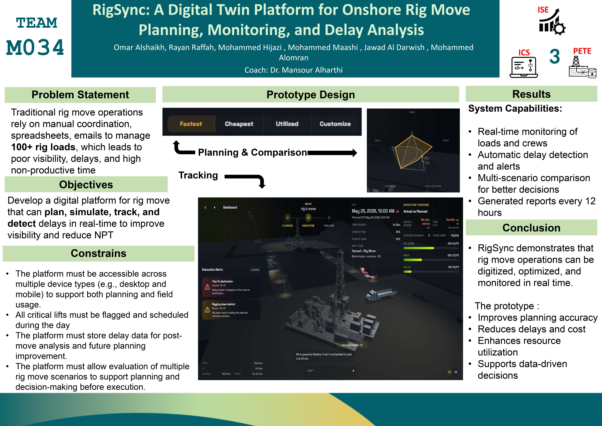

# RigSync

**Digital twin platform for rig move planning, fleet coordination, and execution tracking.**


RigSync is a full-stack platform for planning, simulating, and executing land rig moves. It combines planning data, fleet coordination, route visibility, execution tracking, and driver workflows in a single system.

The project includes a web platform for managers and foremen, a Python backend for planning data and operational APIs, and a separate Flutter driver app for field execution.



## Why This Project

Rig moves are high-cost, multi-stage operations that usually depend on fragmented coordination across spreadsheets, calls, static schedules, and manual status updates. That makes planning slower, execution harder to track, and operational decisions less reliable once conditions change in the field.

RigSync was built to bring those workflows into one system. Instead of treating planning, tracking, and driver coordination as separate tasks, the project models them as one connected operational flow.

## Problem It Solves

- Reduces fragmented planning across disconnected tools
- Improves visibility into truck, driver, and rig readiness
- Makes execution progress easier to monitor across move stages
- Supports better planning decisions through scenario comparison
- Connects office-level coordination with field-level execution

## Features

- Plan rig moves from structured load and truck data
- Compare execution scenarios by time, cost, and utilization
- Track progress across rig down, move, and rig up stages
- Manage trucks, drivers, foremen, and rig-level operational state
- Support separate manager, foreman, and driver workflows

## Architecture

```text
frontend/    Web application and dashboards
backend/     Flask API, SQLite models, dataset import
driver_app/  Flutter driver application
docs/        Supporting operational schema docs
```

## Stack

- Frontend: JavaScript, Leaflet, Firebase Web SDK
- Backend: Python, Flask, SQLAlchemy, SQLite
- Mobile: Flutter, Dart
- Services: Firebase Authentication, Firestore, OpenStreetMap, CARTO, OSRM

## Data Model

RigSync separates planning data from live operational data.

- SQLite stores planning tables such as load templates, dependencies, role requirements, and truck specs
- Firestore stores users, active moves, assignments, execution progress, and rig inventory state

## Running Locally

Install Python dependencies:

```powershell
python -m pip install -r requirements.txt
```

Import the planning dataset:

```powershell
python backend/import_dataset.py
```

If needed, point the importer to a different workbook:

```powershell
$env:RIGSYNC_DATASET_PATH="C:\path\to\your\workbook.xlsx"
python backend/import_dataset.py
```

Run the app:

```powershell
python backend/app.py
```

Open `http://127.0.0.1:5000`.

## Driver App

From `driver_app/`:

```bash
flutter pub get
flutter run
```

Demo driver credentials:

- Email: `driver@rigsync.com`
- Password: `123456`

## Key Files

- [backend/app.py](/abs/path/c/Users/7jmo7/Desktop/Github/RigSync/backend/app.py)
- [backend/import_dataset.py](/abs/path/c/Users/7jmo7/Desktop/Github/RigSync/backend/import_dataset.py)
- [frontend/main.js](/abs/path/c/Users/7jmo7/Desktop/Github/RigSync/frontend/main.js)
- [frontend/pages/RigMovePage.js](/abs/path/c/Users/7jmo7/Desktop/Github/RigSync/frontend/pages/RigMovePage.js)
- [frontend/pages/ManagerDashboardPage.js](/abs/path/c/Users/7jmo7/Desktop/Github/RigSync/frontend/pages/ManagerDashboardPage.js)
- [docs/firebase-operational-schema.md](/abs/path/c/Users/7jmo7/Desktop/Github/RigSync/docs/firebase-operational-schema.md)
